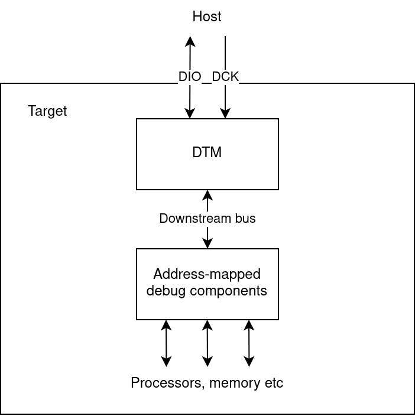

# Two-Wire Debug

A low-pin-count debug transport. Read the asciidoc version of the specification [here](spec/twd.adoc), or clone this repository to build the PDF.

## Overview

Two-Wire Debug is not a complete debug architecture, though it drops neatly into existing ones. It's focused on one problem: connecting a serial probe on the _host_ (e.g. your laptop) to an address-mapped bus inside of some _target_ hardware (e.g. an embedded Linux board), without being a member of IEEE.

Two-Wire Debug specification defines:

* The Two-Wire Debug (TWD) serial bus
	* Two wires: DCK (debug clock) and DIO (debug data in/out)
* The Debug Transport Module (DTM)
	* Bridges TWD to a downstream address-mapped bus



In the image:

* The host uses TWD serial to communicate with a DTM inside the target
* The DTM accesses an array of address-mapped debug hardware. For example:
	* A RISC-V Debug Module
	* An array of CoreSight Access Ports
	* Direct bus access

Features of TWD:

* Two wires
* Commands break down into bytes, for simple SPI host support
* Errors are accumulative, only reported when explicitly polled by the host
	* Designed for efficiency when commands are batched and status is checked at the end
* Multidrop -- up to 16 targets on the same TWD bus
	* Standard method of setting target addresses, provided reset lines can be independently controlled
* Downstream bus has 32-bit data width, 8- to 64-bit address width (word-addressed)

For more details, read the asciidoc version of the spec [here](spec/twd.adoc), or clone this repository to build the PDF.

## Status

Two-Wire Debug is a work in progress. Everything is subject to change.

## Building the PDF Specification

On Ubuntu 21.04:

```bash
# Prerequisites
sudo apt install ruby-asciidoctor-pdf

git clone https://github.com/Wren6991/TwoWireDebug.git twowiredebug
cd twowiredebug/spec
make
# Or,
make view
```

## Directories

* The `spec/` directory contains the source of the Two Wire Debug specification.
* The `hdl/` directory contains an example implementation of a Debug Transport Module
	* Written in Verilog 2005
	* APB3 downstream bus
* The `test/` directory contains some simulation-based tests for that DTM implementation.
