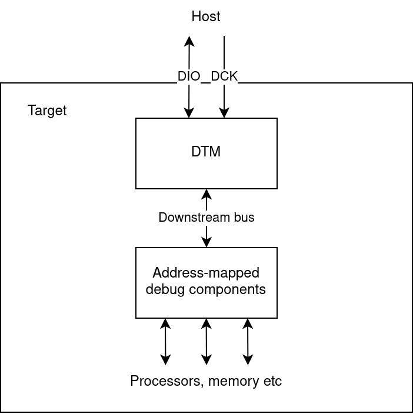
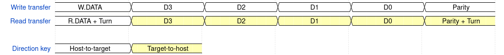
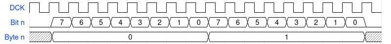
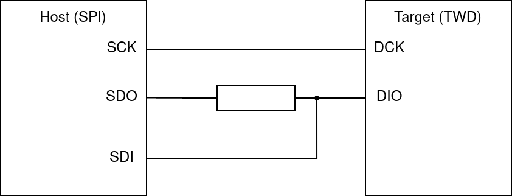

:sectnums:
:toc:
:toclevels: 3
:doctype: book

:times: ×

= Two-Wire Debug

== Introduction

This specification defines:

* The Two-Wire Debug (TWD) serial bus
* The Debug Transport Module (DTM), which bridges a TWD connection to a downstream bus

.A Two-Wire Debug system. The host uses the DCK and DIO signals to communicate with the DTM. From there, the host can access the target's internal debug hardware.

Throughout this document, _target_ refers to the device under test -- an integrated system with a single DTM, some address-mapped debug components on a bus downstream of the DTM, and presumably an actual system to be debugged -- and _host_ refers to the system communicating with and commanding the DTM, e.g. a developer's laptop and a USB debug probe.

The downstream bus supports 32-bit aligned reads and writes, with a fixed address width between 8 and 64 bits, in multiples of 8. Further details of the bus are implementation-defined, and should be invisible to the DTM. Any address-mapped hardware could be attached, such as: a RISC-V Debug Module, CoreSight Access Ports with a CoreSight ROM table, or direct system bus access.

Features of TWD:

* Two wires: DCK (debug clock) and DIO (debug serial data in/out)
** Both with mandatory pull-down resistors
* Supports 32-bit read/writes on an 8- to 64-bit address space
* Commands break down into bytes, for simple SPI host support
* All errors are accumulative
** Transfers don't have a response phase; errors are explicitly polled after a command batch
** An error causes the DTM to ignore further commands until the error is checked and cleared
* Multidrop bus, with a standard method of setting 4-bit multidrop address

Two-Wire Debug is an open specification.

== TWD Serial Bus

Two-Wire Debug is a synchronous serial bus, with two mandatory pins: DCK (debug clock) and DIO (debug data in/out). Data travels in both directions on the DIO pin, synchronous to the DCK pin. A TWD target may also have these optional debug pins:

* An external asynchronous reset pin, which _must_ reset the DTM if present, and is recommended to reset the rest of the target too
* Optional strap pins for configuring the multidrop address (<<multidrop>>).

DCK is a clock driven by the host, and is not required to be free-running, but it is possible to drive DCK continuously without initiating new commands.

Data travelling in the host-to-target direction may be referred to as _write_ data, and in the target-to-host direction as _read_ data. Each TWD command consists of a whole number of bytes:

* A _command_ byte, in the host-to-target direction
* One or more _payload_ bytes, in either direction
* A _parity_ byte in the same direction as the data

.Example of a read and write transfer. Bus turnaround is integral to command and parity bytes.

Data order within each byte is MSB-first, and when multi-byte values are transferred, they are little-endian on the wire.

.Bytes are MSB-first, multi-byte values are little-endian.

At the target, data is captured at the rising edge of DCK, and is also launched on the rising edge of DCK. The host is responsible for maintaining good setup and hold for data captured by the target, and sampling data launched by the target at the appropriate time.

=== Command Bytes

The command byte specifies what operation the host wishes to perform. This also determines the count and direction of payload bytes.

.Structure of a command byte

A command byte consists of:

* A leading 1 start bit
* A 4-bit command code
* An odd parity bit
* Two turnaround bits

The DTM uses the start bit to detect the beginning of the command. Consequently, the host can issue any number of idle clocks on DCK, with DIO driven low, and this will not initiate a command.

The command code specifies what operation the host is requesting, and therefore the direction and number of payload bytes. The listing can be found in <<command-listing>>. The four command bits are protected by an _odd_ parity bit.

The two turnaround cycles give time for the bus direction to be reversed during a read command. (See <<bus-tristating>>.) On write commands, the host drives DIO low for these two cycles, and on read commands, the host tristates its DIO output for these two cycles, and then continues tristating for the duration of the payload and parity bytes. The command codes are chosen such that the parity bit is always 0 for a read command, thus parking the line before the turnaround.

The DTM responds to a command parity failure by setting the write parity error bit in the <<reg-csr>> and entering the Disconnected link state (<<connected-and-disconnected>>).

=== Parity Bytes

The parity byte contains a simple checksum of the payload bytes, and travels in the same direction (host-to-target or target-to-host) as the payload bytes, depending on whether a read or write command was initiated by the command byte.

.Structure of a parity byte

The parity byte consists of:

* An odd parity bit for the payload
* A zero bit
* Two turnaround bits
* (Optionally) four zero bits, driven by the host, to round up to a whole byte

The DTM responds to a write parity failure by setting the write parity error bit in the <<reg-csr>> and entering the Disconnected link state (<<connected-and-disconnected>>).

The turnaround cycles provide a gap between the target driving data during a read command, and the beginning of the next command byte. See <<bus-tristating>>. During a write transfer, these are driven as 0.

After four cycles, the DTM considers the parity "byte" to be over. If a new command follows immediately, the DTM will recognise this command, and this slightly reduces bus overhead. However, the host is free to insert idle cycles to pad this to a whole byte, e.g. if SPI hardware is used on the host side.

[[connected-and-disconnected]]
=== Connected and Disconnected States

After power-on, the DTM is in the _Disconnected_ state. In this state, the DTM ignores all commands, and its DIO output remains tristated.

When the DTM detects an appropriate _Connect_ sequence, issued by the host, it enters the _Connected_ state, whereupon it begins to respond to commands. The DTM will not enter the Connected state for any other reason.

The DTM returns to the Disconnected state on any of the following:

* A Disconnect command (see <<command-listing>>)
* A command or write payload parity error
* Assertion of the target's reset pin, if it has one
* Power cycling of the target

The Connect sequence consists of the following:

1. Eight zero-bits
2. The following 8-byte magic sequence: `0xa7, 0xa3, 0x92, 0xdd, 0x9a, 0xbf, 0x04, 0x31`, sent MSB-first
3. A 4-bit multidrop address (see <<multidrop>>), then an _odd_ multidrop address parity bit, then four zero bits

The DTM must correctly detect a Connect sequence preceded by any sequence of bits, including an aborted partial Connect sequence.

The 8-byte magic sequence is the output of a 6-bit LFSR with taps `0x30` and initial state `0x29`. Consequently it does not contain a run of 8 bits, and so the DTM can use the leading zero-bits to find the start of the Connect sequence. The DTM is permitted to match on a Connect sequence with fewer than eight leading zero-bits, but the host must send at least eight leading bits.

For a multidrop address of 0 the full 80-bit Connect sequence is: `0x00, 0xa7, 0xa3, 0x92, 0xdd, 0x9a, 0xbf, 0x04, 0x31, 0x08`.

=== Error Handling

The DTM may encounter errors due to some issue on the downstream bus, or an illegal value written to a DTM register. In this case the DTM sets some error flag in its CSR, and then begins to suppress all side effects of any command other than `DISCONNECT` and `CSR.W` until the error is cleared. Other commands:

* Will not modify the DTM's internal registers (including incrementing the address register).
* Will not initiate a downstream bus access.

The <<dtm-chapter>> chapter goes into more detail about why these errors happen, and how the host can respond.

As long as there are no command or write payload parity errors, the DTM remains in the Connected state, and continues to decode incoming commands.

[[multidrop]]
=== Multidrop

A host can debug up to 16 targets sharing the same DCK and DIO signals. Each target has a 4-bit multidrop address, which is present in the Connect sequence (<<connected-and-disconnected>>). There are two ways to configure the multidrop address:

* (Mandatory support) Writing to <<reg-csr>>.`MDROPADDR`
* (Optional support) External strap pins to configure the initial value of `MDROPADDR`

On power cycle or assertion of the target's reset pin, `MDROPADDR` resets to the value selected by the strap pins, or zero if there are no strap pins. If there _are_ strap pins, the address zero must be available as an option, and `MDROPADDR` must still be fully writable.

To connect to a particular target, the host issues a Connect sequence with the relevant multidrop address. Targets ignore a Connect sequence with the wrong multidrop address, or a bad multidrop address parity bit, and remain in the Disconnected state.

To switch to a different target, the host issues a Disconnect command (<<command-listing>>) followed by a Connect sequence for the new target.

To assign addresses to multiple targets without address strap pins, the host must have individual control of the external reset pin of each target, and must know in advance how many targets there are. The procedure is:

1. Assert all reset pins
2. Release the resets one at a time. For each target:
** Issue a Connect sequence to multidrop address 0
** Write a unique nonzero target address to <<reg-csr>>.`MDROPADDR`
** Issue a Disconnect command

The final target can be left at its initial multidrop address of zero.

[[bus-tristating]]
=== Bus Tristating

TWD is designed to use a single, bidirectional data line (DIO). Whichever end is currently receiving data tristates its DIO output buffer to avoid driving against the opposite end's output buffer.

More specifically, the host tristates its output at the following times:

* The last two cycles of a read command byte (command-to-payload turnaround)
* Read payload bytes
* The first four cycles of a read parity byte

The target tristates its output at all times _except_ the following:

* Read payload bytes
* The first two cycles of a read parity byte

Turnaround cycles at the end of a read command byte and read parity byte provide a brief safe period, where neither end should be driving DIO, and DIO is simply held low by the bus pulldown resistor. The last bit driven before a turnaround is always a 0: this leaves the line charged in a 0 state, which is maintained by the pull-down.

On a command or write data parity error, the DTM immediately enters the Disconnected line state, causing the target to keep its output tristated until the host notices the disconnection and issues a Connect sequence. This is under the assumption that the DTM has desynchronised from the command stream, and can not safely time its tristating.

Though TWD has been designed to avoid simultaneous driving of the bus, it's recommended to use pads that can survive driving into a short indefinitely, or fit appropriate series resistors to limit the short current.

Because TWD is byte-oriented, it is suitable for use with SPI hardware on the host side. SPI has two unidirectional data pins, rather than a single bidirectional data pin, but this can be adapted with a low-valued series resistor on the SPI output pin:

.Adapting SPI host to TWD target with a series resistor

If this method is used, the host should drive 0s at the point where it ought to tristate its input, as the line would normally be pulled low during turnaround cycles.

[[dtm-chapter]]
== Debug Transfer Module

A Debug Transfer Module (DTM) is a bridge between an TWD serial bus, and an internal address-mapped bus. Its internal state consists primarily of:

* A control and status register (<<reg-csr>>) 32 bits in size
* An address register (<<reg-addr>>), 8 to 64 bits in size
* A bus data buffer, 32 bits in size

[[command-listing]]
=== Command Listing

Summary of commands:

[%autowidth.stretch, options="header"]
|===
| Opcode | Command | Brief | Payload

|`0x0` |<<cmd-disconnect>>| Enter the Disconnected state                       | None
|`0x1` |<<cmd-r.idcode>>  | Read device identifier                             | 4 bytes read
|`0x2` |<<cmd-r.csr>>     | Read control/status register                       | 4 bytes read
|`0x3` |<<cmd-w.csr>>     | Write control/status register                      | 4 bytes write
|`0x4` |<<cmd-r.addr>>    | Read address register                              | 1-8 bytes read
|`0x5` |<<cmd-w.addr>>    | Write address register                             | 1-8 bytes write
|`0x7` |<<cmd-r.data>>    | Perform bus read, and get result of last `R.DATA`  | 4 bytes read
|`0x8` |<<cmd-r.buff>>    | Get result of last `R.DATA`                        | 4 bytes read
|`0x9` |<<cmd-w.data>>    | Perform bus write                                  | 4 bytes write
|Others|Reserved          | Host should never issue. Target should Disconnect. |

|===

[[cmd-disconnect]]
==== DISCONNECT

This instruction is used to deliberately disconnect from the DTM, without setting any error flags in the CSR. For example, when switching to a different target. See <<connected-and-disconnected>> for more information on the Connected and Disconnected states.

`DISCONNECT` and `W.CSR` are the only side-effecting commmands the DTM will accept when an error flag is raised in the <<reg-csr>>.

[[cmd-r.idcode]]
==== R.IDCODE

Return a 32-bit value that may be helpul in identifying the target. This command has no side effects.

If the LSB is 1, this value is formatted identically to a standard JTAG IDCODE register, as below.

[cols="10h,20h,~", options="header"]
|===
| Bits | Name | Description
| 31:28 | `VERSION` | Device revision number
| 27:12 | `PARTNO` | Device part number, in manufacturer-specific format
| 11:8 | `BANK` | JEP106 continuation code count
| 7:1 | `ID` | JEP106 identifier (without parity)
| 0 | `ISJTAG` | If 1, this register is formatted as a JTAG IDCODE register.
|===

If the LSB is 0, then either:

* The register is all-zeroes: no identification information is available
* The LSBs are `'b00`, register is nonzero: reserved
* The LSBs are `'b10`: register is in some implementation-defined format

[[cmd-r.csr]]
==== R.CSR

Read the 32-bit control and status register (<<reg-csr>>). This command has no side effects.

[[cmd-w.csr]]
==== W.CSR

Write the 32-bit control and status register (<<reg-csr>>).

`DISCONNECT` and `W.CSR` are the only side-effecting commmands the DTM will accept when an error flag is raised in the CSR.

[[cmd-w.addr]]
==== W.ADDR

Write to the address register (<<reg-addr>>). The size of the address register is fixed when the target is manufactured, and can be determined by reading the `ASIZE` field of the <<reg-csr>>.

For random accesses, a `W.ADDR` must be issued before each `W.DATA` or `R.DATA`. For sequential access to incrementing addresses, or repeated access to the same address, this is unnecessary, and multiple bus accesses can be performed without any intervening address register writes.

If any error flag is set in the <<reg-csr>>, `W.ADDR` is ignored. If a downstream bus access is still in progress at the point a `W.ADDR` is issued, the <<reg-csr>>.`EBUSY` flag is set, and <<addr>> is not written.

[[cmd-r.addr]]
==== R.ADDR

Read back the current value of <<reg-addr>>.

This can be used to diagnose at what point in a sequence of incrementing reads/writes an error was raised, since the address register will have stopped incrementing immediately afterward.

[[cmd-r.data]]
==== R.DATA

Initiate a downstream bus read, and return the result of the last completed downstream bus read.

If a `W.DATA` command has been issued since the last `R.DATA`, or the last `R.DATA` encountered a downstream bus error, this `R.DATA` command returns an undefined value.

If any error flag is set in the <<reg-csr>>, this command has no side effect. No downstream bus access is initiated.

If there are no error flags set, and a downstream bus access is still in progress at the point an this command is issued:

* Set the <<reg-csr>>.`EBUSY` error flag
* Do not initiate a new access
* Do not increment <<reg-addr>>

Finally, if a downstream bus access is not currently in progress, and no error flags are set in the <<reg-csr>>, a `R.DATA` command will initiate a new downstream read access at the address indicated by <<reg-addr>>

If <<reg-csr>>.`AINCR` is set, <<reg-addr>> is incremented by 1 _after_ the downstream bus access completes.

[[cmd-r.buff]]
==== R.BUFF

Return the same value as `R.DATA`, but without initiating a downstream bus access. This command is issued at the end of a sequence of `R.DATA` commands, to collect the last read result.

If there are no error flags set, and a downstream bus access is still in progress at the point an this command is issued, `R.BUFF` will set the <<reg-csr>>.`EBUSY` error flag.

[[cmd-w.data]]
==== W.DATA

Initiate a downstream bus write.

If any error flag is set in the <<reg-csr>>, this command has no side effect. No downstream bus access is initiated.

If there are no error flags set, and a downstream bus access is still in progress at the point an this command is issued:

* Set the <<reg-csr>>.`EBUSY` error flag
* Do not initiate a new access

Finally, if a downstream bus access is not currently in progress, and no error flags are set in the <<reg-csr>>, a `W.DATA` command will initiate a new downstream write access at the address indicated by <<reg-addr>>, with the data payload of the current command

If <<reg-csr>>.`AINCR` is set, <<reg-addr>> is incremented by 1 _after_ the downstream bus access completes.

=== Registers

[[reg-csr]]
==== CSR

[cols="10h,20h,~", options="header"]
|===
| Bits | Name | Description
| 31:28 | `VERSION`      | TWD protocol version (read-only). Must = 1.
| 26:24 | `ASIZE`        | Address register size (read-only). Size in bits = 8 × (1 + `ASIZE`)
| 22    | `EPARITY`      | Set when write data or command parity error is detected. Write 1 to clear.
| 21    | `EBUSFAULT`    | Set when a downstream bus access results in a bus fault, e.g. due to an unmapped address. Write 1 to clear.
| 20    | `EBUSY`        | Set when the host attempts to initiate a downstream bus access or write to <<reg-addr>> whilst a previous access is still in progress. Write 1 to clear.
| 16    | `AINCR`        | Address increment enable (read-write). If 1, <<reg-addr>> is incremented by 1 each time a downstream bus access completes without error, assuming no error flags are set.
| 12    | `BUSY`         | Busy flag (read-only). Can be polled for completion of a transfer.
| 9     | `NDTMRESET`    | Request a reset of the entire target system, except for the DTM. Read-write. The host can hold the system in reset by leaving this bit set to 1. There is no minimum duration for the host asserting `NDMRESET` -- it must be possible to reset the system by writing a 1 and then immediately a 0.

If target reset is not supported, this bit must be hardwired to 0.
| 8     | `NDTMRESETACK` | Sticky flag to acknowledge the system has come out of reset following the deassertion of `NDTMRESET`. Write 1 to clear.
| 7:4   | `MDROPADDR`    | The 4-bit multidrop address for this DTM (read-write).
|===

[[reg-addr]]
==== ADDR

This register contains an 8- to 64-bit address. This is a _word_ address, not a byte address. In other words, an 8-bit address register can address all word-aligned address in a region of 256 words, or 1024 bytes. If host software or the downstream bus prefer to work in _byte_ addresses, their addresses must be scaled accordingly.

`ADDR` has an auto-increment feature, to support efficient sequential read/writes from the host. This feature is enabled by setting <<reg-csr>>.`AINCR` to 1. When enabled, `ADDR` increments when:

* A downstream bus access completes, and
* That downstream bus access did not encounter any errors, and
* No error flags are set in the CSR

Since the expected use case of `AINCR` is large batches of reads/writes from the host, with error flags checked at the end, it is important that `ADDR` stops incrementing when an error is encountered, so that the host can determine where in the read/write sequence the problem occurred.
