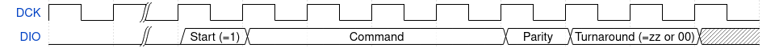

:sectnums:
:toc:
:toclevels: 3
:doctype: book

:times: ×

= Two-Wire Debug

== Introduction

This specification defines:

* The Two-Wire Debug (TWD) serial bus
* A hardware component, the _Debug Transport Module_ (DTM), which bridges a TWD external serial connection to a downstream address-mapped bus

.A Two-Wire Debug system. The host uses the DCK and DIO signals to communicate with the DTM. From there, the host can access the target's internal debug hardware.

Throughout this document, _target_ refers to the device under test -- an integrated system with a single DTM, some address-mapped debug components on a bus downstream of the DTM, and presumably an actual system to be debugged -- and _host_ refers to the system communicating with and commanding the DTM, e.g. a developer's laptop and a USB debug probe.

The downstream bus supports 32-bit aligned reads and writes, with a fixed address width between 8 and 64 bits, in multiples of 8. Further details of the bus are implementation-defined, and should be invisible to the DTM. Any address-mapped hardware could be attached, such as: a RISC-V Debug Module, CoreSight Access Ports with a CoreSight ROM table, or direct system bus access.

Features of TWD:

* Two wires: DCK (debug clock) and DIO (debug serial data in/out)
** Both with a mandatory pull-down resistor on the target side
* Supports 32-bit read/writes on an 8 to 64-bit address space
* Commands break down into bytes, for simple SPI host support
* All errors are accumulative
** Transfers don't have a response phase; errors are explicitly polled after a command batch
** An error causes the DTM to ignore further commands until the error is checked and cleared
* Multidrop bus, with a standard method of setting 4-bit multidrop address

Two-Wire Debug is an open specification.

== TWD Serial Bus

Two-Wire Debug is a synchronous serial bus, with two mandatory pins: DCK (debug clock) and DIO (debug data in/out). Data travels in both directions on the DIO pin, synchronous to the DCK pin. A TWD target may also have these optional debug pins:

* An external asynchronous reset pin, which _must_ reset the DTM if present, and is recommended to reset the rest of the target too
* Optional strap pins for configuring the multidrop address (<<multidrop>>).

DCK is a clock driven by the host, and is not required to be free-running, but it is possible to drive DCK continuously without initiating new commands.

Data travelling in the host-to-target direction may be referred to as _write_ data, and in the target-to-host direction as _read_ data. Each TWD command consists of a whole number of bytes:

* A _command_ byte, in the host-to-target direction
* One or more _payload_ bytes, in either direction
* A _parity_ byte in the same direction as the data

.Example of a read and write transfer. Bus turnaround is integral to command and parity bytes.
image::img/read_write_fmt.png[pdfwidth=100%,align=center]

Data order within each byte is MSB-first, and when multi-byte values are transferred, they are big-endian on the wire.

.Bytes are MSB-first, multi-byte values are big-endian.
image::img/bit_byte_order.png[pdfwidth=100%,align=center]

At the target, data is captured at the rising edge of DCK, and is also launched on the rising edge of DCK. The host is responsible for maintaining good setup and hold for data captured by the target, and sampling data launched by the target at the appropriate time.

=== Command Bytes

The command byte specifies what operation the host wishes to perform. This also determines the count and direction of payload bytes.

.Structure of a command byte

A command byte consists of:

* A leading 1 start bit
* A 4-bit command code
* An odd parity bit
* Two turnaround bits

The DTM uses the start bit to detect the beginning of the command. Consequently, the host can issue any number of idle clocks on DCK, with DIO driven low, and this will not initiate a command.

The command code specifies what operation the host is requesting, and therefore the direction and number of payload bytes. The four command bits are protected by an _odd_ parity bit (an XOR reduction).

The two turnaround cycles give time for the bus direction to be reversed during a read command. (See <<bus-tristating>>.) On write commands, the host drives DIO low for these two cycles, and on read commands, the host tristates its DIO output for these two cycles, and then continues tristating for the duration of the payload and parity bytes. The command codes are chosen such that the parity bit is always 0 for a read command, thus parking the line before the turnaround.

The DTM responds to a command parity failure by setting the write parity error bit in the CSR (TODO) and entering the Disconnected link state (<<connected-and-disconnected>>).

[[command-listing]]
==== Command Listing

Summary of commands:

[%autowidth.stretch, options="header"]
|===
| Opcode | Instruction name | Description | Payload

|`0x1` |`R.ID`      | Read ID register                                   | 4 bytes read
|`0x2` |`R.CSR`     | Read control/status register                       | 4 bytes read
|`0x3` |`W.CSR`     | Write control/status register                      | 4 bytes write
|`0x4` |`R.ADDR`    | Read address register                              | 1-8 bytes read
|`0x5` |`W.ADDR`    | Write address register                             | 1-8 bytes write
|`0x7` |`R.DATA`    | Perform bus read, and get result of last `R.DATA`  | 4 bytes read
|`0x8` |`R.BUFF`    | Get result of last `R.DATA`                        | 4 bytes read
|`0x9` |`W.DATA`    | Perform bus write                                  | 4 bytes write
|`0xf` |`DISCONNECT`| Enter the Disconnected state                       | None
|Others|Reserved    | Host should never issue. Target should Disconnect. |

|===

=== Parity Bytes

The parity byte contains a simple checksum of the payload bytes, and travels in the same direction (host-to-target or target-to-host) as the payload bytes, depending on whether a read or write command was initiated by the command byte.

.Structure of a parity byte
image::img/parity_byte_fmt.png[pdfwidth=100%,align=center]

The parity byte consists of:

* Four parity bits: P3, P2, P1, P0
** P3 is the XOR reduction of bits 7 and 3 of all payload bytes
** P2 is the XOR reduction of bits 6 and 2 of all payload bytes
** P1 is the XOR reduction of bits 5 and 1 of all payload bytes
** P0 is the XOR reduction of bits 4 and 0 of all payload bytes
* Two zero bits
* Two turnaround bits

The turnaround cycles provide a gap between the target driving data during a read command, and the beginning of the next command byte. See <<bus-tristating>>

[[connected-and-disconnected]]
=== Connected and Disconnected States

After power-on, the DTM is in the _Disconnected_ state. In this state, the DTM ignores all commands, and its DIO output remains tristated.

When the DTM detects an appropriate _Connect_ sequence, issued by the host, it enters the _Connected_ state, whereupon it begins to respond to commands. The DTM will not enter the Connected state for any other reason.

The DTM returns to the Disconnected state on any of the following:

* A Disconnect command (see <<command-listing>>)
* A command or write payload parity error
* Assertion of the target's reset pin, if it has one
* Power cycling of the target

The Connect sequence consists of the following:

1. Eight zero-bits
2. The following 8-byte magic sequence: `0xa7, 0xa3, 0x92, 0xdd, 0x9a, 0xbf, 0x04, 0x31`, sent MSB-first
3. A 4-bit multidrop address (see <<multidrop>>), then an _odd_ multidrop address parity bit, then four zero bits

The DTM must correctly detect a Connect sequence preceded by any sequence of bits, including an aborted partial Connect sequence.

The 8-byte magic sequence is the output of a 6-bit LFSR with taps `0x30` and initial state `0x29`. Consequently it does not contain a run of 8 bits, and so the DTM can use the leading zero-bits to find the start of the Connect sequence. The DTM is permitted to match on a Connect sequence with fewer than eight leading zero-bits, but the host must send at least eight leading bits.

For a multidrop address of 0 the full 80-bit Connect sequence is: `0x00, 0xa7, 0xa3, 0x92, 0xdd, 0x9a, 0xbf, 0x04, 0x31, 0x08`.

=== Error Handling

The DTM may encounter errors due to some issue on the downstream bus, or an illegal value written to a DTM register. In this case the DTM sets some error flag in its CSR, and then begins to suppress all side effects of any command other than `DISCONNECT` and `CSR.W` until the error is cleared. Other commands:

* Will not modify the DTM's internal registers (including incrementing the address register).
* Will not initiate a downstream bus access.

The <<dtm-chapter>> chapter goes into more detail about why these errors happen, and how the host can respond.

As long as there are no command or write payload parity errors, the DTM remains in the Connected state, and continues to decode incoming commands.

Since hosts will often batch up commands, a recommended pattern is to append a `CSR.R` to the end of each batch to pick up the accumulated errors.

[[multidrop]]
=== Multidrop

A host can debug up to 16 targets sharing the same DCK and DIO signals. Each target has a 4-bit multidrop address, which is present in the Connect sequence (<<connected-and-disconnected>>). There are two ways to configure the multidrop address:

* (Mandatory support) Writing to the CSR.MDROPADDR
* (Optional support) External strap pins to configure the initial value of CSR.MDROPADDR

On power cycle or assertion of the target's reset pin, CSR.MDROPADDR resets to the value selected by the strap pins, or zero if there are no strap pins. If there _are_ strap pins, the address zero must be available as an option, and CSR.MDROPADDR must still be fully writable.

To connect to a particular target, the host issues a Connect sequence with the relevant multidrop address. Targets ignore a Connect sequence with the wrong multidrop addresses, or a multidrop address parity failure, and remain in the Disconnected state.

To switch to a different target, the host issues a Disconnect command (<<command-listing>>) followed by a Connect sequence for the new target.

To assign addresses to multiple targets without address strap pins, the host must have individual control of the external reset pin of each target, and must know in advance how many targets there are. The procedure is:

1. Assert all reset pins
2. Release the resets one at a time. For each target:
** Issue a Connect sequence to multidrop address 0
** Write a unique nonzero target address to CSR.MDROPADDR
** Issue a Disconnect command

The final target can be left at its initial multidrop address of zero.

[[bus-tristating]]
=== Bus Tristating

TWD is designed to use a single, bidirectional data line (DIO). Whichever end is currently receiving data tristates its DIO output buffer to avoid driving against the opposite end's output buffer.

More specifically, the host tristates its output at the following times:

* The last two cycles of a read command byte (command to payload turnaround)
* The payload and checksum bytes of a read command

The target tristates its output at all times _except_ the following:

* Read payload bytes (unless the read command was ignored due to a previous error)
* The first six cycles of a read parity byte

Turnaround cycles at the end of a read command byte and read parity byte provide a brief safe period, where neither end should be driving DIO, and DIO is simply held low by the bus pulldown resistor. The last bit driven before a turnaround is always a 0: this leaves the line charged in a 0 state, which is maintained by the pull-down.

On any write or data parity error, the DTM immediately enters the Disconnected line state, causing the target to keep its output tristated until the host notices the disconnection and issues a Connect sequence. This is under the assumption that the DTM has now desynchronised from the command stream, and can not safely time its tristating.

Though TWD has been designed to avoid simultaneous driving of the bus, it's recommended to use pads that can survive driving into a short indefinitely, or fit appropriate series resistors to limit the short current.

Because TWD is byte-oriented, it is suitable for use with SPI hardware on the host side. SPI has two unidirectional data pins, rather than a single bidirectional data pin, but this can be adapted with a low-valued series resistor on the SPI output pin:

.Adapting SPI host to TWD target with a series resistor
image::img/spi_to_twd.drawio.png[pdfwidth=40%,align=center]

If this method is used, the host should drive 0s at the point where it ought to tristate its input, as the line would normally be pulled low during turnaround cycles.

[[dtm-chapter]]
== Debug Transfer Module

fooble
